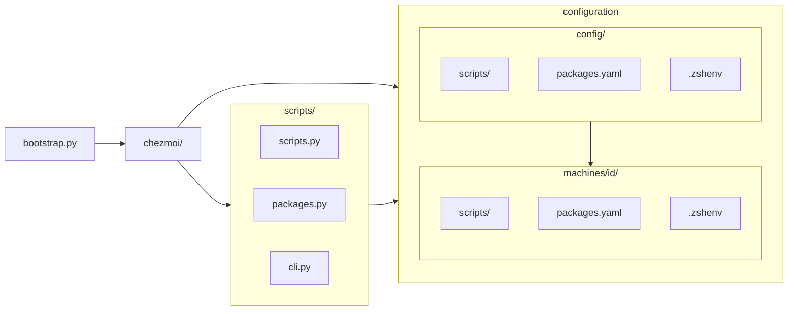

# Machine Setup & Dotfiles

A cross‑platform Chezmoi setup to bootstrap, deploy, and version‑control environments across macOS, Windows, and Linux.

- `chezmoi/` orchestrates the process;
- `scripts/` act as infrastructure;
- `config/` provides shared defaults while
- `machines/<id>/` supplies per‑machine overrides.



## Requirements

- Python 3.8+
- Xcode Command Line Tools (macOS)
- PowerShell 7.0+ (Windows)

Xcode Command Line Tools can be installed with:

```sh
xcode-select --install
sudo xcodebuild -license accept
```

Windows can install Python and PowerShell from the Microsoft Store or using:

```powershell
winget install Python.Python3.12 # 3.8+
winget install Microsoft.Powershell # 7.0+
```

## Installation

Run the following command to install Chezmoi and bootstrap a machine:

```sh
# shell
repo="https://raw.githubusercontent.com/mohdfareed/machine/refs/heads/main"
curl -fsLS "$repo/bootstrap.py" | python3 -
```

```powershell
# powershell
$repo = "https://raw.githubusercontent.com/mohdfareed/machine/refs/heads/main"
curl -fsLS "$repo/bootstrap.py" | python3 -
```

## Usage

After bootstrapping, the machine will be set up with Chezmoi installed. The following are commands to manage the configuration:

```sh
chezmoi init --apply   # apply machine config
chezmoi update         # update repo and reapply config
chezmoi status         # show status of the config
code $MACHINE          # open repo in vscode
```

### Machine Settings

- Variables used across the system:
  - `MACHINE`: repo root (e.g., `~/.machine`)
  - `MACHINE_ID`: selected machine profile (e.g., `macbook`)
  - `MACHINE_PRIVATE`: path to private files (default `~/.private`)
- How they’re set:
  - Chezmoi template `.chezmoi.toml.tmpl` prompts on first apply (or uses env if set).
  - Shell profiles (`.zshenv`, `profile.ps1`) export them for interactive shells.
  - Script runner passes these vars to Python scripts using environment variables.

### Scripting

- Put shared scripts in `config/scripts/` and machine-specific in `machines/<id>/scripts/`.
- OS suffixes are respected.
  - Examples: `*.macos.sh`, `*.linux.sh`, `*.win.ps1`, `*.unix.sh`.
  - Combinations are supported, e.g., `*.linux.wsl.sh` runs on both Linux and WSL.
- Phases are triggered by filename prefixes via Chezmoi:
  - `before_*` → runs before apply
  - `after_*` → runs after apply
  - `once_*` → runs only once
  - `onchange_*` → runs when content changes

### Package Management

- Package installs: editing `config/packages.yaml` or `machines/<id>/packages.yaml` triggers an `onchange_*` script that installs packages.
- A script can be defined as another package entry to install a package using a custom method.
- Supported package managers:
  - macOS: `brew`, `mas`
  - Linux: `apt`, `snap`,
  - Windows: `winget`, `scoop`

### SSH Setup

- Add keys: place your keys in `$MACHINE_PRIVATE/ssh/`.
  - Example: `personal` + `personal.pub` or `tool.key` + `tool.pub`.
- Configure SSH: edit `machines/<id>/ssh.config` for per‑machine settings.

### Machine Backup

- Commit and push changes to local repositories.
- Review installed apps and their configurations.
- Review machine config files.

## TODO

- Create `config.yaml` that is parsed by `chezmoi`. The `.toml` template can parse it, read machine config, and prompt only for missing values.
- The same file can be reused to define scripts to run, packages to install, etc.
