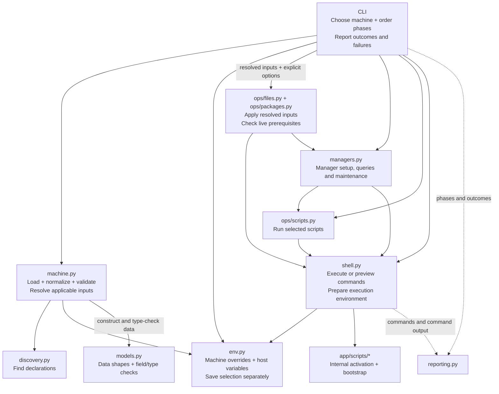
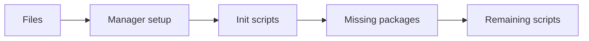
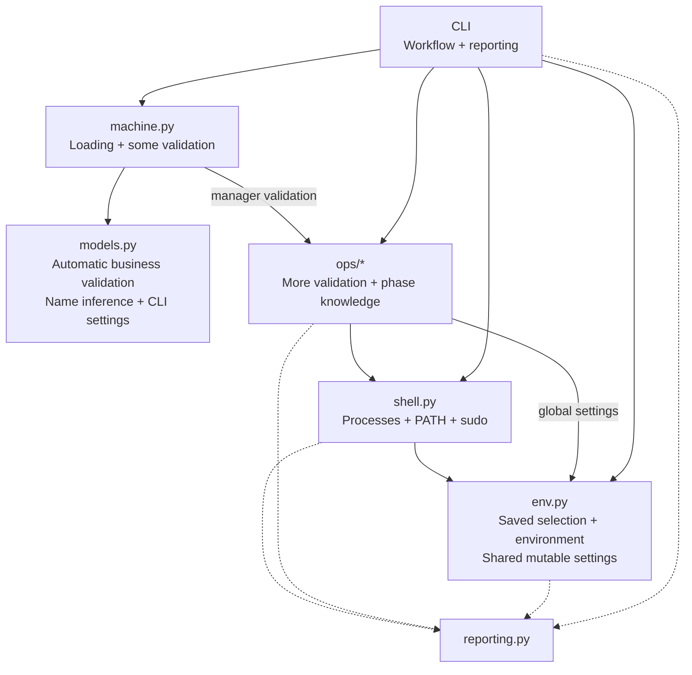

# Application architecture

The CLI owns workflow, the loader owns declaration rules, and operations own live
work. Models describe data. Only CLI modules and the shell boundary use reporting.
Solid arrows below show calls/dependencies; dotted arrows show reporting calls.
Shared data-type imports are omitted.

## Current boundaries

| Owner | Responsibility |
| --- | --- |
| [cli/entry.py](cli/entry.py), [cli/__init__.py](cli/__init__.py) | Register commands, keep options in one invocation's Typer context, and report failures once. Shared callbacks and metadata do not depend back on entry. |
| [deploy](cli/deploy.py), [upgrade](cli/upgrade.py), [sync](cli/sync.py), [info](cli/info.py) | Order phases, pass resolved inputs, save selection, present outcomes. Only deploy/upgrade classify `init_` and `up_` scripts. Information commands do not prepare interpreters or query installed packages. |
| [models.py](models.py) | Field/type checks and data relationships. No business validators, name inference, CLI settings or installed-package metadata. `selected_source` carries the loader's package decision in private storage, outside the `Package(...)` constructor and schema. Unknown package arguments are rejected. |
| [machine.py](machine.py), [discovery.py](discovery.py) | One `load_machine(id, modules, *, env)` entry. Discover/import declarations, include selected dependencies and overrides, filter platform/helpers, normalize paths/names, validate declarations and resolve sources before execution. No subprocesses or operation imports. |
| [env.py](env.py) | Build explicit machine overrides, read host variables, resolve configured paths, and separately read/write the saved default. No reporting, interpreter preparation or mutable invocation settings. |
| [files.py](ops/files.py) | Inspect live links/permissions, preserve real targets, deploy one resolved mapping, and return its changed target or raise with recovery context. |
| [packages.py](ops/packages.py) | Consume resolved package choices; return skipped package names for CLI presentation and run missing installs or custom upgrades through managers and shell. |
| [managers.py](managers.py) | Check manager readiness/presence, set up declared managers, install packages and maintain managers. Own manager-specific commands, identities and exit handling. |
| [scripts.py](ops/scripts.py), [shell.py](shell.py) | Execute selected scripts without recognizing workflow prefixes. Shell owns processes, command output and environment/interpreter preparation, including its supporting scripts under `app/scripts/`. |
| [reporting.py](reporting.py) | Private Rich consoles and small rendering functions. No application dependencies, result tracking or logging. |

Operations depend in one direction: packages → managers → scripts → shell, and
files → shell. Lower layers never import CLI or another module's private helpers.
Public interfaces come before private helpers; recipe comments explain meaningful
steps, and alternatives/failures leave early so the main path stays flat.

## Command flows

`show` displays resolved configuration; its `id`, `home`, `private` and `status`
subcommands expose selection and runtime details. `list` discovers machines and modules.

Deploy builds the selected environment and loads configuration, then checks manager
prerequisites before saving selection or deploying files. The remaining order is:

Manager installers live in [app/scripts](scripts). Each subsequent
lookup or command prepares its own environment; phases never refresh PATH themselves.

Upgrade checks installed managers, upgrades all their packages, then runs selected
custom package upgrades and `up_` scripts. Module filters include prerequisites and
related overrides but exclude unrelated machine extras. Manager upgrades remain global.

Sync fetches canonical main, merges fast-forward-only with autostash, checks actual
unmerged files, then refreshes the CLI and completion. Failure stops the refresh;
conflicting local edits remain available for Git recovery. It obtains the installed
CLI location from `uv tool dir --bin`. Sync does not request sudo.

## Environment and execution

`build_env(id)` derives the selected machine's base paths, overlays committed
`machine.env`, and loads `$MC_PRIVATE/env/$MC_ID.env`. It returns only explicit
overrides; inherited variables are used for expansion without freezing the host PATH.
The default private directory is `<repository>/private`. Private values do not
change the resolved machine identity or base directories. `show private` resolves the
path without reading secret contents. Older saved files need only `MC_ID` because
base paths are derived again, rather than taken from stale saved values.

The same overrides reach file normalization, packages, manager setup and scripts.
Only manager setup adds `MC_PKG_MANAGERS`. `set_current_machine` only
saves the default/base variables; environment construction never depends on that write.

`process_env(overrides)` prepares the environment before each command and executable
lookup. It removes inherited Git repository and diff-tool context so commands select
their own repositories, while preserving global Git configuration and SSH settings.
Unix inherits the remaining caller variables and sources
[app/scripts/environment.unix.sh](scripts/environment.unix.sh) in a bounded, noninteractive
shell. This internal helper activates installed commands and is also used by Zsh. It must remain
quiet, read-only and safe with missing tools or repeated sourcing. Explicit overrides
win after activation; user profiles are never run by the app.

Windows reads current registered machine/user variables, expands their references
using the selected overrides, and puts registered PATH entries before preserved
caller entries. Explicit PATH replaces both. This supports newly installed tools;
it does not reconstruct a login session or remove inherited variables/directories
that were deleted from registration. Execution machinery stays in the app.
`config/` is the catalog of selectable modules; `machines/` composes them.
Neither is a location for special application entrypoints.

`run(cmd, *, env, dry_run, ...)` announces commands and returns the process result,
or `None` when a preview skips execution. It inherits the terminal unless capture
is needed; `echo_output` relays captured output through the shell reporting boundary.
`query(cmd, *, env, ...)` always performs a quiet bounded read, including in previews.
Both use the same environment preparation as `find_executable`. Previewed `run` calls
skip preparation and execution; availability queries still inspect current state.

Scripts and commands inherit the caller's working directory. Configured file targets
must resolve to absolute paths before mutation. Scripts needing repository resources
use explicit paths. Script execution does not interpret deployment phase prefixes.

PowerShell execution uses Windows PowerShell on Windows and Core on Unix
(`pwsh`, falling back to `pwsh-preview`), with
`-NoProfile` and `-File`. Module paths are prepared for that interpreter immediately
before real execution, so PowerShell installed earlier in the run receives
[MachineAdmin](scripts/MachineAdmin/MachineAdmin.psm1) through `app/scripts/` on
`PSModulePath`. Its temporary elevation-output
relay preserves Windows behavior without creating persistent logs.

## Preview, failure and state

`--dry-run`/`-n` belongs to `deploy`, `upgrade` and `sync`, after the command name.
It announces preview mode once before lifecycle work; action messages stay
the same. Previews inspect real package presence and file permissions, then skip writes,
installs and script execution. A manager/interpreter that would be installed is
not queried before it exists. Scripts and a future Git merge cannot be simulated;
preview completion does not certify their future results.

Existing real file targets move to the next free adjacent backup before linking.
A later failure preserves that backup but can leave the original target absent;
errors identify recovery paths. Unix permission previews compare the source mode.
Windows mappings with permissions deliberately reapply them, including owner-only
ACLs, and previews report that same work instead of requiring an ACL comparison system.

An operation error stops the workflow. Lower layers add relevant context and raise;
CLI entry reports the failure, with a traceback for `--debug`. Prior effects are not
rolled back. External scripts must propagate their own internal failures.

The only saved application selection is `~/.env`. Links, permissions, backups and
installed tools are deployment effects. Package presence is cached only within one
install call. There is no script history, ownership map, aggregate failure report,
sudo keepalive, persistent log or command transcript.

## Enforcement

[tests/test_architecture.py](../tests/test_architecture.py) checks allowed imports,
reporting access and private boundaries. Behavioral tests cover selected-environment
propagation, validation before mutation, preview decisions, package identity, file
preservation, failure handling and Git recovery. Use `./scripts/check.sh` plus
representative CLI paths. Git fixtures clear inherited `GIT_*` variables before
initialization and disable user/system configuration so temporary repositories
cannot use the caller's repository or index. Windows ACL/elevation behavior still requires verification
on Windows; passing mocked calls on macOS is not that verification.

Before this refactor

Validation was split across model construction, loading and installation. Saving
selection was a prerequisite for building its environment, so previews could use
the wrong machine. Operations chose their own messages, and the script executor
interpreted `init_` to refresh global PATH. Deferred imports hid an entry/command cycle.

