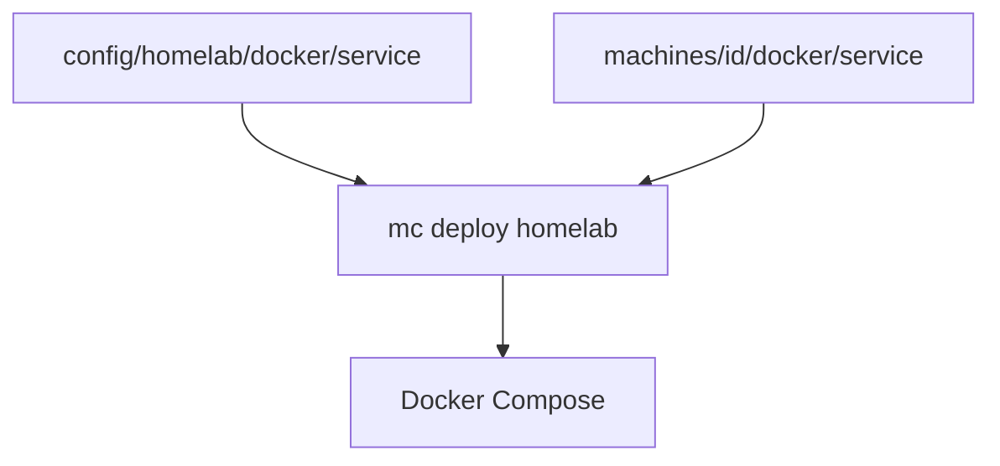

# Homelab deployment

A homelab is a personal server setup for self-hosting Docker services.
The dashboard uses the host's Tailscale HTTPS address;
`tailscale serve status` shows it.

Installs Docker (Linux) and Tailscale, deploys services, and configures
Tailscale networking.

[macOS setup](../../machines/homelab/README.md) ·
[Media setup](../../machines/homelab/docker/media/README.md)

## macOS Sharing

After every macOS homelab deployment, open **System Settings → General → Sharing**
and configure or verify access for that machine:

- Remote Login: check allowed users and remote-user Full Disk Access as needed.
- Remote Management: choose your account and its required privileges.
- File Sharing: choose shared folders and read/write permissions; enable your
  account under Options → Windows File Sharing. Configure the Time Machine
  backup-destination option on its share if used.

Grant required Full Disk Access under Privacy & Security. Share selection and
permissions are manual; deployment does not infer them.

Configure macOS updates in **System Settings → General → Software Update →
Automatic Updates**. OS updates and restarts follow those settings, independently
of `mc upgrade`.

## Tailscale

- Create an auth key at
  [Tailscale Console](https://console.tailscale.com/admin/settings/keys)
  and store it in `$MC_PRIVATE/machine.env` below.
- Auth key properties:
  - Reusable,
  - ephemeral (optional),
  - pre-approved (optional),
  - tags (`tag:container`)

```env
# `$MC_PRIVATE/machine.env`
TAILNET_NAME=<tailnet-name-without-.ts.net>
TS_DOCKER_AUTHKEY=tskey-client-<id>-<secret>
```

After starting containers, approve their devices in
[Tailscale Machines](https://login.tailscale.com/admin/machines) if not pre-
approved to allow cross-container communication.

Add to the [tailnet policy](https://login.tailscale.com/admin/acls):

```jsonc
"tagOwners": { "tag:container": ["autogroup:admin"] },
"nodeAttrs": [{ "target": ["tag:container"], "attr": ["funnel"] }]
"grants": [
    {
        "src": ["tag:container"],
        "dst": ["tag:container"],
        "ip": ["tcp:443"],
    },
],
```

**Note:** Funnel is enabled per container/service. each service's
`AllowFunnel` in `serve.json` decides whether to use it.

> Example ACLs configuration at [`tailscale.acl.jsonc`](./tailscale.acl.jsonc).

### Networking

Services are exposed via Tailscale at `service-name.<tailnet>.ts.net`
using one of three patterns:

| Pattern               | How                                        | Example    |
| --------------------- | ------------------------------------------ | ---------- |
| **Internet (funnel)** | Tailscale sidecar with `AllowFunnel: true` | Public app |
| **Tailnet only**      | Host loopback port + `tailscale serve`     | Homepage   |
| **Internal**          | No sidecar, no ports - container-only      | Worker bot |

## Docker

Finish Docker Desktop's first launch, then enable **Settings → General → Start
Docker Desktop when you sign in to your computer**. After reboot, its user must
sign in before Docker Desktop starts.

The deployment script runs Docker Compose directly from repository service
directories. Compose defines the runtime data locations; relative bind mounts live
inside the repository service directory.

### Add a service

Create a `<service>/compose.yaml` file per service at:

- `machines/<id>/docker/`; or
- `config/homelab/docker/` for shared services (for multiple deployments).


```mermaid
flowchart TD
    Shared["config/homelab/docker/service"] --> Deploy["mc deploy homelab"]
    Machine["machines/id/docker/service"] --> Deploy
    Deploy --> Compose["Docker Compose"]
```

### Deploy or update

Run on the target machine, with `homelab` included in its manifest:

```sh
mc deploy homelab
```

This pulls/builds and starts **all** its Compose stacks.
For an individual service, open its repository directory:

```sh
mc::secrets # alias to load private env vars
docker compose up -d --build
docker compose logs --follow
```
