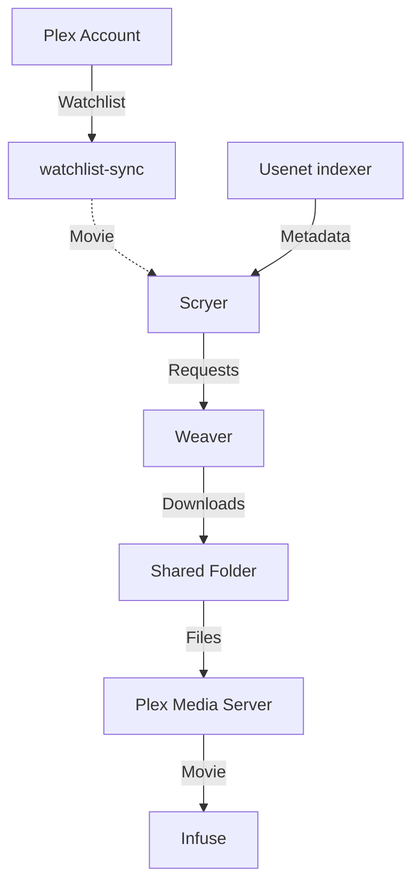

# Media

**Services:**

| App    | Address                           | Role                      |
| ------ | --------------------------------- | ------------------------- |
| Plex   | `https://plex.<tailnet>.ts.net`   | Playback and organization |
| Scryer | `https://scryer.<tailnet>.ts.net` | Acquisition and subtitles |
| Weaver | `https://weaver.<tailnet>.ts.net` | Usenet downloader         |

**Internal networking:**

| Type   | Host        | Port    | Credentials    |
| ------ | ----------- | ------- | -------------- |
| Weaver | `ts-weaver` | `9090`  | API Key        |
| Scryer | `ts-scryer` | `8080`  | API Key        |
| Weaver | `ts-plex`   | `32400` | Online Account |

---



## Kickstart

Use this order on a fresh install; restored `data/` keeps the existing setup.

1. Complete the [Tailscale setup](../../../../config/homelab/README.md#first-setup)
   and make sure the media storage is mounted.
2. Get a token from <https://www.plex.tv/claim>, export `PLEX_CLAIM` in the
   current process, then deploy the stack:

   ```sh
   export PLEX_CLAIM=claim-...
   mc apply homelab
   ```

3. Approve the new Tailscale devices if auth key requires it.

## Services Setup

### Weaver

- Set server `news.newsdemon.com:563` (enable TLS and set connections=50).
- In **Settings → Security**, create an **integration** API key for Scryer.

### Scryer

Create the admin account, then configure:

- Libraries: `/data/movies`, `/data/series`, and `/data/anime` if used.
- Usenet indexer (`api.nzbgeek.info`) to Weaver.
- OpenSubtitles: account and wanted languages.

Weaver is built in. Use the **Weaver** type, not NZBGet.
**SSL off**, **URL base empty**, then test.

### Plex

- Add the same library folders as Scryer, scan, and connect
  [Infuse](https://firecore.com/infuse).
- Enable Plex notifications.

Plex's watchlist is synced to Scryer, which will download new items automatically.
This is done via [watchlist-sync](https://github.com/mohdfareed/watchlist-sync).
