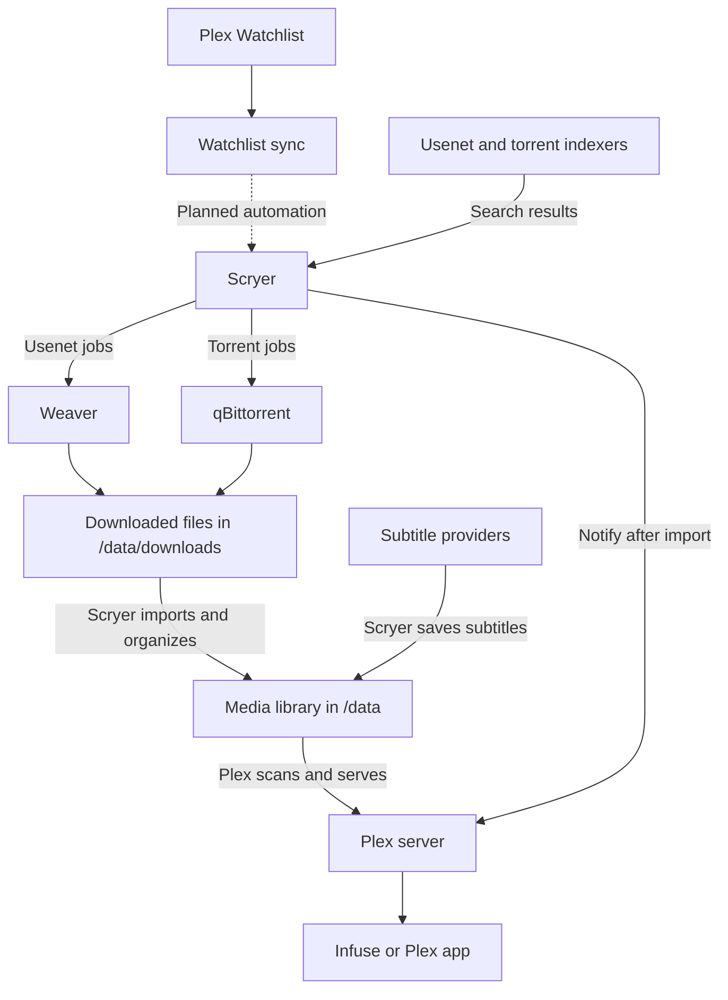

# Media

**Plex** manages and serves media to Plex clients (e.g. [Infuse](https://firecore.com/infuse)),
**Scryer** manages acquisition and subtitles, **Weaver** downloads Usenet releases,
and **qBittorrent** downloads torrents.

[Watchlist sync](https://github.com/mohdfareed/plex-watchlist-sync) builds directly
from its own repository. It currently polls and logs Plex watchlist items;
submission to Scryer is not implemented yet.

## Design

Indexers find releases; downloaders fetch them; Scryer imports them into the
library; Plex serves them to your player. All four applications share the same
host media directory as `/data`, so no remote path mappings are needed.

## Access

| Service     | Private address                        |
| ----------- | -------------------------------------- |
| Plex        | `https://plex.<tailnet>.ts.net`        |
| Scryer      | `https://scryer.<tailnet>.ts.net`      |
| Weaver      | `https://weaver.<tailnet>.ts.net`      |
| qBittorrent | `https://qbittorrent.<tailnet>.ts.net` |

## Setup

After deploying the stack, connect to Tailscale and open the addresses above.
Complete these steps in order. Browser access uses the HTTPS addresses; the
`ts-...` hostnames below are internal Docker addresses for app-to-app connections.

### 1. Prepare the downloaders

**Weaver**

1. Add your Usenet provider's server address, port, TLS setting, and credentials.
   _Personal source:_ `news.newsdemon.com:563`
2. Set the incomplete directory to `/data/downloads/incomplete` and the completed
   directory to `/data/downloads/complete`.
3. In **Settings → Security**, create an API key with **integration** scope for
   Scryer. Keep it for step 3.

**qBittorrent**

1. On a fresh installation, run `docker logs qbittorrent` to find the temporary
   password. Sign in as `admin`, then set a permanent password under
   **Settings → Web UI**. Existing installations retain their login.
2. Under **Settings → Downloads**, set the default save path to
   `/data/downloads/torrents` before adding torrents. Keep the stock Web UI.

### 2. Set up Scryer's libraries

Create or configure the libraries with these paths. Reuse existing media in
place; these are container paths, not paths on your Mac.

| Library        | Root folder    |
| -------------- | -------------- |
| Movies         | `/data/movies` |
| TV series      | `/data/series` |
| Anime, if used | `/data/anime`  |

Choose the quality profile and monitoring preferences for each library.

### 3. Connect Scryer to the downloaders

In **Scryer → Settings → Download Clients**, create these entries:

| Type            | Host             | Port   | Authentication                    |
| --------------- | ---------------- | ------ | --------------------------------- |
| **Weaver**      | `ts-weaver`      | `9090` | Integration API key from step 1   |
| **qBittorrent** | `ts-qbittorrent` | `8080` | qBittorrent username and password |

Weaver is built in. Install the **qBittorrent** download-client plugin from
Scryer's plugin catalog before adding that client. For both entries, leave
**URL base** empty and **SSL** off, then save and test the connection.
Select the correct **Type** when creating each entry: naming an NZBGet entry
“Weaver” does not make it a Weaver client.

### 4. Add search and subtitle providers to Scryer

- Add your Usenet indexer and route its downloads to Weaver.
  _Personal source:_ `api.nzbgeek.info`
- Add your torrent indexer and route its downloads to qBittorrent.
- Configure **OpenSubtitles** with your account and select the subtitle languages
  you want Scryer to obtain.

### 5. Connect Plex and your player

1. In Plex, add the matching library folders from step 2 and scan them.
2. In Scryer, configure **Plex notifications** using `http://ts-plex:32400` and
   your Plex server token so imports trigger a library refresh.
3. Connect Infuse to your Plex server, or use a Plex app directly.
