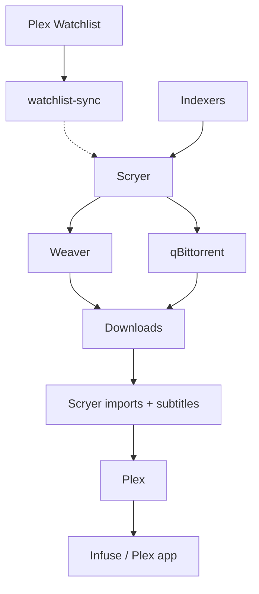

# Media

[Tailscale / deployment](../../../../config/homelab/README.md) ·
[Backups](../../README.md#backups)



| App         | Address                                | Role                      |
| ----------- | -------------------------------------- | ------------------------- |
| Plex        | `https://plex.<tailnet>.ts.net`        | Playback and organization |
| Scryer      | `https://scryer.<tailnet>.ts.net`      | Acquisition and subtitles |
| Weaver      | `https://weaver.<tailnet>.ts.net`      | Usenet downloader         |
| qBittorrent | `https://qbittorrent.<tailnet>.ts.net` | Torrent downloader        |

## First start

Use this order on a fresh install; restored `data/` keeps the existing setup.

1. Complete the [Tailscale setup](../../../../config/homelab/README.md#first-setup)
   and make sure the media storage is mounted.
2. Get a token from <https://www.plex.tv/claim>, export `PLEX_CLAIM` in the
   current process, then deploy the stack:

   ```sh
   export PLEX_CLAIM=claim-...
   mc apply homelab
   ```

3. Approve the new Tailscale devices if auth key requires it.

## App setup

### Downloaders

- **Weaver:**
  - Set server `news.newsdemon.com:563` (enable TLS and set connections=50).
  - In **Settings → Security**, create an **integration** API key for Scryer.
- **qBittorrent:**
  - Get the temporary `admin` password with `docker compose logs qbittorrent`.
  - Set a permanent one in **Settings → Web UI**.
  - Set the save path to `/data/downloads/torrents`.

### Scryer

Create the admin account, then configure:

- Libraries: `/data/movies`, `/data/series`, and `/data/anime` if used.
- Usenet indexer (`api.nzbgeek.info`) → Weaver. Torrent indexer → qBittorrent.
- OpenSubtitles: account and wanted languages.

**Settings → Download Clients:**

| Type        | Host             | Port   | Credentials            |
| ----------- | ---------------- | ------ | ---------------------- |
| Weaver      | `ts-weaver`      | `9090` | Weaver integration key |
| qBittorrent | `ts-qbittorrent` | `8080` | qBittorrent login      |

Install the qBittorrent plugin first; Weaver is built in. Use the **Weaver** type,
not NZBGet. Both connections: **SSL off**, **URL base empty**, then test.

### Plex

Add the same library folders as Scryer, scan, and connect
[Infuse](https://firecore.com/infuse).
For Scryer's Plex notifications: `http://ts-plex:32400`.

Plex's watchlist is synced to Scryer, which will download new items automatically.
This is done via [watchlist-sync](https://github.com/mohdfareed/watchlist-sync).
