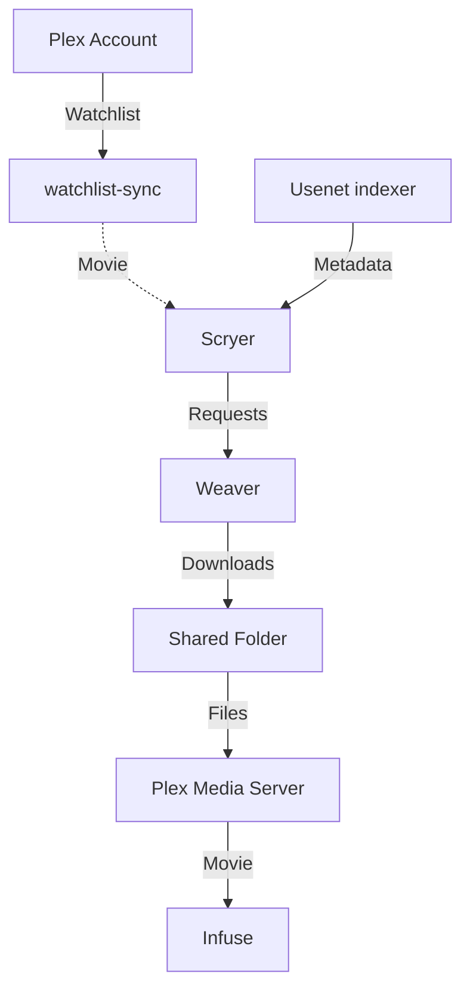

# Media

**Services:**

| App    | Address                           | Role                      |
| ------ | --------------------------------- | ------------------------- |
| Plex   | `https://plex.<tailnet>.ts.net`   | Playback and organization |
| Scryer | `https://scryer.<tailnet>.ts.net` | Acquisition and subtitles |
| Weaver | `https://weaver.<tailnet>.ts.net` | Usenet downloader         |

**Internal networking:**

| App    | Host     | Port    | Credentials    |
| ------ | -------- | ------- | -------------- |
| Weaver | `weaver` | `9090`  | API Key        |
| Scryer | `scryer` | `8080`  | API Key        |
| Plex   | `plex`   | `32400` | Online Account |

---


```mermaid
flowchart TD
    Plex["Plex Account"] -->|Watchlist| Sync["watchlist-sync"]
    Sync -.->|Movie| Scryer
    Indexers["Usenet indexer"] -->|Metadata| Scryer
    Scryer -->|Requests| Weaver

    Weaver -->|Downloads| Import["Shared Folder"]
    Import -->|Files| PlexServer["Plex Media Server"]
    PlexServer -->|Movie| Infuse["Infuse"]
```

## Kickstart

Use this order on a fresh install; existing app state keeps its setup.

1. Make sure the media storage is mounted and Tailscale Services are configured.
2. Get a token from <https://www.plex.tv/claim>, export `PLEX_CLAIM` in the
   current process, then deploy the stack on the homelab:

   ```sh
   export PLEX_CLAIM=claim-...
   mc deploy -m homelab
   ```

3. Approve the gateway's Service advertisements in Tailscale Admin if they are
   not auto-approved.

## Services Setup

### Weaver

- Set server `news.newsdemon.com:563` (enable TLS and set connections=50).
- In **Settings -> Security**, create an **integration** API key for Scryer.
- Set download path in settings to `/data/downloads`.

### Scryer

Create the admin account, then configure:

- Libraries: `/data/movies`, `/data/series`, and `/data/anime` if used.
- Connect Weaver at `http://weaver:9090` with the API key created above.
  Set NZBGet type to Weaver.
- Usenet indexer (`api.nzbgeek.info`) to Weaver.
- OpenSubtitles: wanted languages.
  - Enable timing correction and set thresholds to 100% with 180s max offset.
  - Ensure Docker is using gRPC FUSE.
  - **NOTE:** This is due to a delay in the default engine of ~100-150 ms
    in file metadata causing subtitle time correction in Scryer to fail to
    find the subtitles on the server.
- Set `Import Behavior` of all catalogs to `Move`.
- Connect Plex. Set base URL to `http://plex:32400`.
- Enable Telegram and Plex notifications.
  - Telegram:
    - Download Failed
    - Import Completed
    - Import Blocked
    - Upgrade Imported
    - Subtitle Search Failed
    - Media Request Submitted
  - Plex:
    - Import Completed
    - Upgrade Imported
    - File Renamed
    - File Deleted

### Plex

- Add the same library folders as Scryer, scan, and connect
  [Infuse](https://firecore.com/infuse).
- Plan for direct play or software transcoding: Docker's Linux VM does not provide
  macOS VideoToolbox hardware transcoding.

The Plex watchlist is synced to Scryer, which will download new items automatically.
This is done via [watchlist-sync](https://github.com/mohdfareed/watchlist-sync).
Supply `SCRYER_API_KEY` through the launcher's secret references after creating the
key in Scryer.
